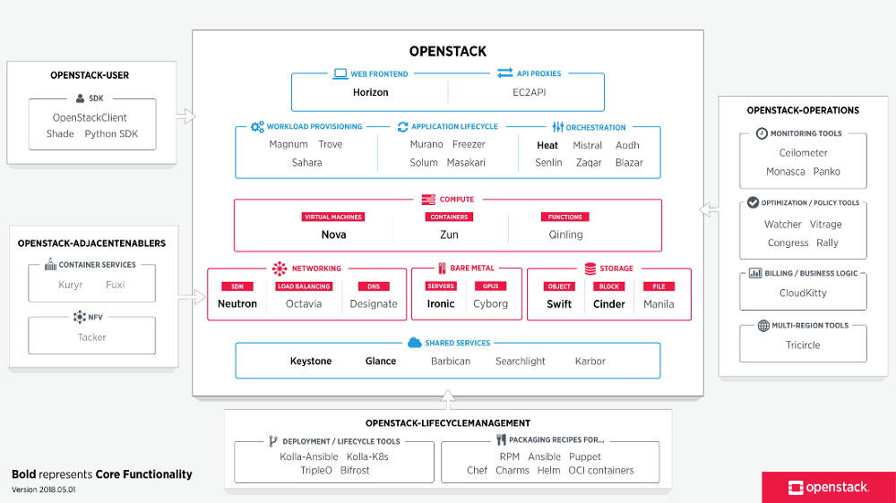

We all have been consumed by news articles by some upcoming technology that has taken the world by storm and is going to “disrupt” an entire industry.
Be it cryptocurrency to financial markets, Theranos to blood tests, PiedPiper to data compression and AI/ML to every industry imaginable. All the examples of new technologies are driven by one key factor — **Hype.**

As being part of the field of Software engineering (a novice one), I try to look for new technologies to learn. Something new comes around and I just get excited to read and learn the new technology. Little did I know that the whole tech world is driven by Hype. This concept first came to my mind when I came across an article Hype Driven Development by Marek Kirejczyk. It put into perspective the life-cycle of a technology product. The article provides a good dumb-down version of the Gartner Hype Scale.

Gartner Hype Cycle provides a metric to properly understand and pinpoint the maturity of IT trends. Every IT-related hype is boiled down to five phases:

1.  **Innovation Trigger**
2.  **Peak of inflated Expectations**
3.  **Trough of Disillusionment**
4.  **Slope of Enlightenment**
5.  **Plateau of Productivity**

If the five phases of the Gartner Cycle seem to overwhelm you with words which are a bit difficult to comprehend, then the phases described by [Marek Kirejczyk](https://medium.com/u/1ad34b4ecc2e?source=post_page-----bdbb1adec14----------------------) seem to simplify the aforementioned phases.

1\. Innovation Trigger **— Real-world Problem and Proposed Solution**
2\. Precursor to Peak of Inflated Expectations **— Buzzwords and initial hype**
3\. Peak of Inflated Expectations **— Mania hype begins**
4\. Trough of Disillusionment **— Technology appears to have died**
5\. Slope of Enlightenment **— Learning from mistakes during Peak phase**
6\. Plateau of Productivity **— Realisation**

Gartner Hype Scale

**1\. Innovation Trigger**

Here, the problem statement is defined and an associated “innovative” product is launched.

**2\. Peak of Inflated Expectations**

Through various media, the **_hype is created_**. This **_hype_** can be attributed to news articles, conferences, developer evangelism, marketing tool, Twitter/Reddit discussion threads. Both start-ups and enterprises take note of the hype/technology. Remember, that the rate of adoption is much higher for a start-up than for an enterprise.

**3\. Trough of Disillusionment**

Hype in media dies down. If the trend dies, then it is dusted. If it manages to remain relevant, it undergoes a maturing metamorphosis phase into a viable and sound business product with a sustainable future.

**4\. Slope of Enlightenment**

**_Metamorphosis phase,_** where mistakes are understood and acted upon. Evolving the trend to suit business sustenance.

**5\. Plateau of Productivity**

A second-shot at gaining customers. In the IT world, the first attempt consists of both the start-up and the enterprise world. But for the second shot during Plateau of Productivity, it is primarily focused on enterprises, as these organizations provide a stable source of income for the technology.

* * *

Now we will see the aforementioned phases in relation to an example since examples put everything into a perspective.

We’ll compare the five phases for 2 cloud computing technologies which are at different phases of the Hype Cycle.
These are **OpenStack** and **Kubernetes**.

Openstack
=========

OpenStack, an IaaS which sought to revolutionize the data center by providing infrastructure as a platform. Around 2010, when it was first released as the open-source project jointly initiated by NASA and Rackspace. After its launch, it triggered a big interest in provisioning its own IaaS for Cloud Computing. Big interest includes CERN, who created their entire backbone of the infrastructure based on OpenStack. Over the next couple of years, it garnered a huge hype, which resulted in major conversations in the IT industry as the next step in revolutionizing private-cloud data centers. It provided APIs to manage a company’s own data center. In 2011, when OpenStack first started, AWS was the only major player in the cloud computing landscape. OpenStack positioned itself as the private cloud alternative to AWS.

In terms of hype, it generated its own OpenStack Summit, a bi-annual conference that occurs at. As startups and enterprises alike gained an interest in the technology, the hype soared up to a boiling point. OpenStack summit attendees rose year on year leading to 7,000 attendees in 2014.

But ever since 2014, the hype has dwindled compared to its height in 2012, leading to a **Trough of Disillusionment**. This phase results in articles that proclaim that the technology has now become “Dud” or dead.
In 2018, the conference attendees reduced to 300 (from 7,000 in 2014). You might say the technology has died, leading to obscurity.

[Platinum and Gold Members](https://www.openstack.org/foundation/companies/) (Total 300 Members)

But thanks to the Hype Cycle, we know that it has not died, but has reached a plateau (through Scope of enlightenment). There were 300 OpenSummit attendees whose demographic consisted of primarily enterprise customers. You see the hype is generated by start-ups, who by their Greenfield nature (new development environment) look to see the most attractive IT technology stack driven by a flourishing open-source community to support their own development projects. Enterprises, by their Brownfield nature(existing development environment), take their time in reviewing the up-and-coming technology, making Proofs-of-concept (POC), talking with software providing vendors. Even though there is friction in the adoption of new technology, but at the end of the day, these Enterprises provide the most value (monetary and security) to the adoption of the technology.

Kubernetes
==========

Before Kubernetes (in public domain), there was Docker and before Docker there was VM. Kubernetes came onto the public eye in 2015, after Google donated its “Borg” system to the Cloud Native Computing Foundation (CNCF). By 2018, 3 years after Google released Kubernetes, it became one of the hottest technologies, just like OpenStack was just 3 years back.

The innovation trigger was to simplify

*   The orchestration of containers
*   Application deployment for developers without the need to worry of compute, storage and network resources.

In simple terms, it can be seen as an “infrastructure for infrastructure”. It has become an industry for running containers. It manages to triumph Docker’s own Docker Swarm to run Docker containers due to it being a much more mature technology and ability to handle complex applications. In spite of Google, Azure and Amazon being competitors in the cloud computing market, each one of the cloud providers provide their own flavour of Kubernetes service on top of their cloud infrastructure.

*   Google Kubernetes Engine (GKE)
*   Amazon Elastic Container Service for Kubernetes (EKS)
*   Microsoft Azure Kubernetes Service (AKS)

By 2018, 3 years after Google released Kubernetes, it became one of the hottest technologies, just like OpenStack was just 3 years back.

It is becoming the talking point for IT infrastructure in the cloud-native domain. Therefore, currently, it is in its **_Peak of Inflated Expectations_** phase.

Kubernetes holds a bi-annual conference Kubecon (one in the USA and one in Europe). The most recent Kubecon held in Barcelona attracted over 7,000 attendees (correlation to OpenStack 4 years back). This suggests the Kubernetes is at the peak of inflated expectations phase just like OpenStack was 4 years back.

All the major cloud providers (AWS, Azure, IBM, Oracle), PaaS providers(Pivotal, Redhat), Virtualization providers (VMWare, Citrix) as well as banking sector are betting on Kubernetes. Companies are undergoing the digital transformation of their businesses are turning to Kubernetes and related CNCF projects to help them achieve this goal.

One of the UK’s banking startup Monzo uses Kubernetes for running 600 of their micro-services to build a Cloud-Native Digital Bank breaking the tradition of COBOL-built legacy banking systems.

In this age of evolving age of software engineering from monolithic to microservices (through SOA), and from central to distributed computing, Kubernetes has helped enable to adopt such modern distributed, cloud-native (i.e. container based) software engineering principles as part of its mission.

Whilst Kubernetes sought out to build cloud-native environments whilst Openstack sought to make a cloud-based operating system. In terms of hype, both technologies have seen similar heartbeats in terms of adoption, except that OpenStack came before Kubernetes. Both were and are backed by major corporations, and both depend on their community to keep the project alive and evolving according to the needs of its customers.

* * *

As a closing remark, I would like to point out that technology is never really dying. Technology that supposes to seem legacy systems, are itself a product of evolving phases with lessons learned and corrective measures implemented. They might become irrelevant for the current generation, but its impact on current trends outweighs the current trend’s technology itself.

When we add new technology, we solve prior challenges faced currently which in turn creates new unforeseen challenges which will be solved by future technology. This cycle shall not and will not be broken, leading to the evolution of technologies. Sounds familiar. Maybe Darwinism applies to the IT industry as well.